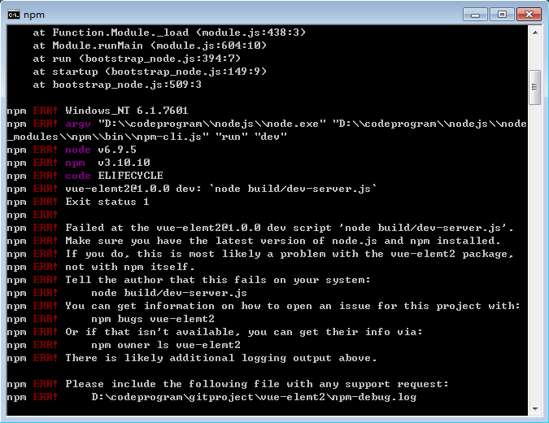
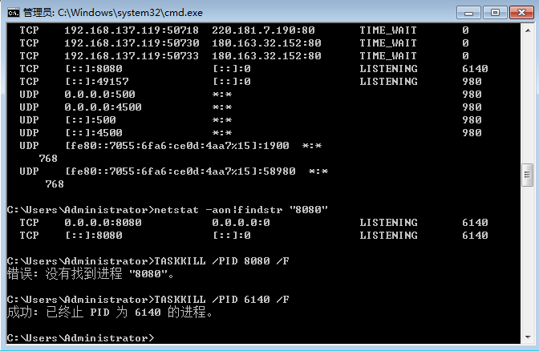
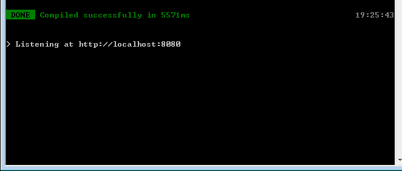

npm run dev报错！  

额，第一次碰到的错误，已经解决了    
安装好 npm install,启动时报错了。 刚开始还以为是npm包版本有错误。

网上查到说可能是端口被占用。Vue默认端口是8080   

  
所以，先查看被占用的进程，然后结束掉进程  
  
  查看8080端口被占用的进程：netstat -ano|findstr "8080"  
*//最后的数字是所占用的进程*  
  
  关闭掉该进程： TASKKILL /PID 6140 /F

最后再试了一下，npm run dev 可以运行了  

---
好像有些同学还是解决不了，不知道有没有其他的原因。  
我先记一下这个解决方法，结束占用8080端口的进程。
